# Geʾez Handwriting Fonts

This repository project attempts the continuation of the original font work by [Educational Fontware, Inc.](https://www.educationalfontware.com/) that help in teaching of handwriting to children who speak languages that are written in the Geʾez (aka “Ethiopic”) script. 

## Background
The Educational Fontware company developed a collection of 14 fonts that illustrate the sequence and direction of written strokes needed to form the Geʾez letters. The collection was developed over a two year period and generously released in 2011 under the [Open Font License](OFL.txt) (OFL). The motivation behind developing the font collection was for use in Ethiopia and Eritrea elementary school education.  The collection was provided to the respective governments, however, the extent of their utilization is unknown.

## Goals
The primary goal of this project is to extend the font with the Ethiopic letters that have been added to the Unicode Standard since the release of the original font collection.  A [compantion project](https://github.com/geezorg/learn-to-write-geez-books) has the aim of developing primer books in various languages that employ the fonts to teach writing.

## The Font Collection
The Geʾez Handwriting typefaces are in a thin handwritten style as would be produced by a pen or pencil. Variations on the style are then created to guide learners in forming the writing strokes used to form a complete letter. A variety of styles that support different approaches to learning writing are reviewed in the follwing sections.

### <ins>Regular</ins> 
<ins>Geʾez Handwriting</ins> (`GeʾezHandwriting.ufo` on the filesystem) is the basic font in the default style where the letters have a handwrtitten appearance as would be seen when formed by a a typical pen or pencil. The regular styles are intended for viewing only, and *not* to be traced over or inside of.

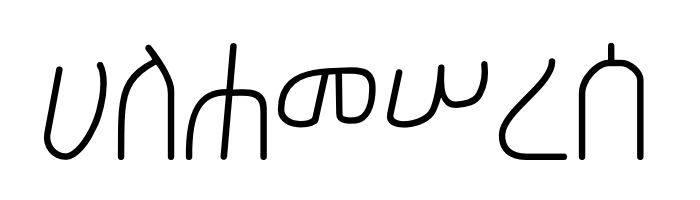

#### With Bold
A **bold weight** typeface of the basic style that can be used for emphasis is also part of the collection and uses the same font name, <ins>Geʾez Handwriting</ins>, as the regular style.  On the filesystem the bold typeface can be found in the `GeʾezHandwritingBold.ufo` folder.

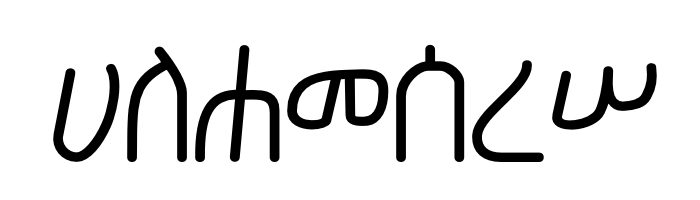

#### With Rules
<ins>Geʾez Handwriting with Rules</ins> (`GeʾezHandwritingwithRules.ufo`) adds writing lines (aka “rules”) as would be seen in a ruled notebook.  The rules help the learner to better perceive the letter heights as well as anchor letters on a common base line.  **Note** that empty rule lines, with no letter inside, can be entered from the keyboard by typing the special letter `|`.  This is intended to help create practice lines for the learning writer.

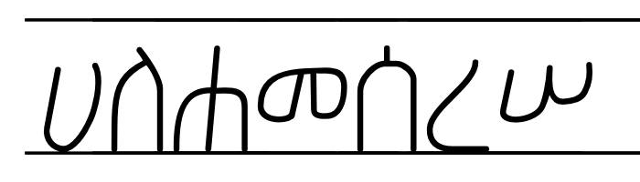

#### With Arrows
<ins>Geʾez Handwriting with Arrows</ins> (`GeʾezHandwritingwithArrows.ufo`) adds directional arrow lines alongside the letter strokes to indicate the direction of writing.

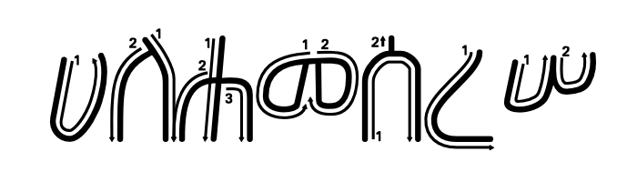

#### With Arrows and Rules
<ins>Geʾez Handwriting Arrows Rules</ins> (`GeʾezHandwritingArrowsRules.ufo`) adds *both* the arrows and rules together to help guide the learner in writing along practice lines.

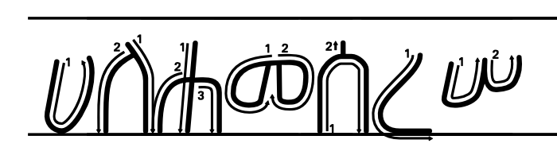

#### Arrows Only
<ins>Geʾez Handwriting Arrows Only</ins> (`GeʾezHandwritingArrowsOnly.ufo`) provides *only* the arrows that indicate stroke direction.  The strokes themselves have been removed. This style is helpful as a reminder to the learner how to form a letter without providing the final result.

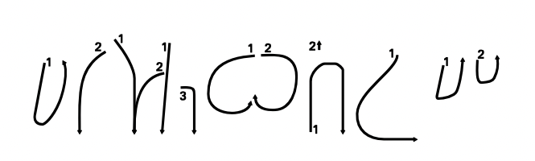

### <ins>Dots</ins>
<ins>Geʾez Handwriting Dots</ins> (`GeʾezHandwritingDots.ufo`) is a style the forms the letter strokes with a sequence of circular dots. The intent of this style is to assist learners through practice where they may trace of the dots to learn the hand motions.

#### With Rules
<ins>Geʾez Handwriting Dots Rules</ins> (`GeʾezHandwritingWithDotsRules.ufo`) adds writing lines (aka “rules”) as would be seen in a ruled notebook.  The rules help the learner to better perceive the letter heights as well as anchor letters on a common base line.

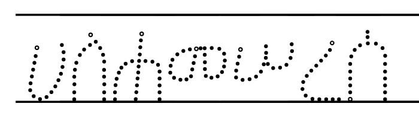

#### With Arrows
<ins>Geʾez Handwriting Dots Arrows</ins> (`GeʾezHandwritingWithDotsArrows.ufo`) adds the directional arrow lines alongside the dot based strokes to indicate the direction of writing.

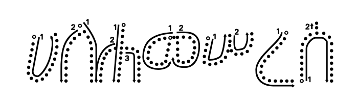

#### With Arrows and Rules
<ins>Geʾez Handwriting Dots Arr Rules</ins> (`GeʾezHandwritingDotsArrRule.ufo`) adds *both* the arrows and rules together to help guide the learner in writing along practice lines.

### <ins>Outlines</ins>

<ins>Geʾez Handwriting Outlines</ins> (`GeʾezHandwritingOutlines.ufo`) is an outline style of the basic font.  Like the dot style, the outline style is intended for practice writing where the learner can trace inside the empty space of the letters.

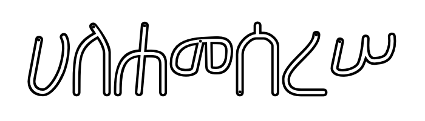

#### With Rules
<ins>Geʾez Handwriting Outlines Rules</ins> (`GeʾezHandwritingOutlinesRule.ufo`) adds writing lines (aka “rules”) as would be seen in a ruled notebook.  The rules help the learner to better perceive the letter heights as well as anchor letters on a common base line.

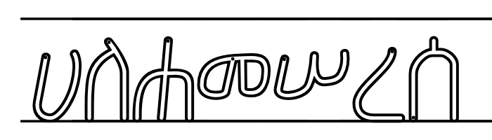

#### With Arrows
<ins>Geʾez Handwriting Out Arrows</ins> (`GeʾezHandwritingOutArrows.ufo`) adds the directional arrow lines alongside the outline based strokes to indicate the direction of writing.

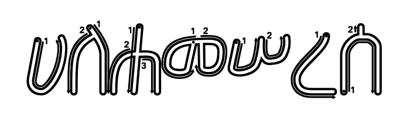

#### With Arrows and Rules
<ins>Geʾez Handwriting Out Arr Rules</ins> (`GeʾezHandwritingOutArrRules.ufo`) adds *both* the arrows and rules together to help guide the learner in writing along practice lines.

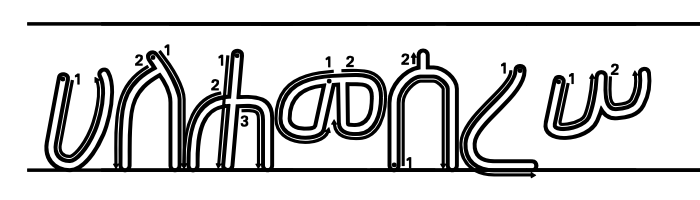

